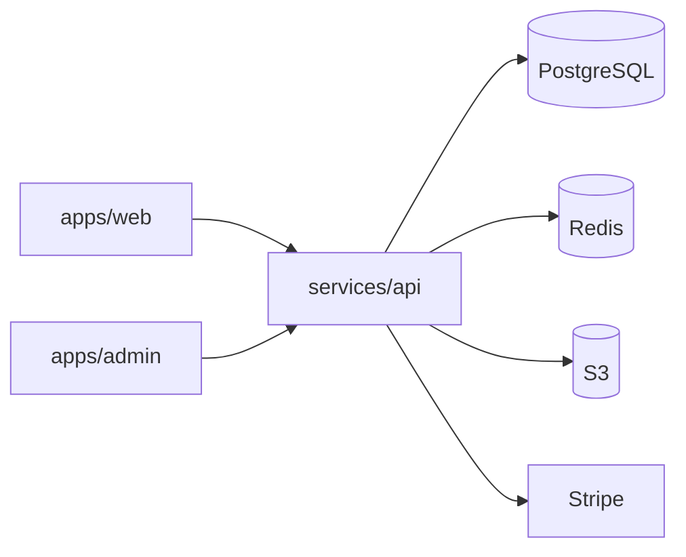

# Watch Store

A production-grade luxury watch e-commerce platform: high-concurrency Spring Boot API, dual Next.js 15 frontends, Redis-backed carts and checkout locks, Stripe payments, 3D product viewports, virtual try-on (VTO), and operational observability—all in a single **pnpm monorepo**.

## Highlights

- **Transactional checkout** — Redis checkout mutex + PostgreSQL pessimistic inventory locks + Stripe PaymentIntent webhooks
- **Catalog at scale** — Filtered PostgreSQL queries with 60s Redis page cache; watch-specific facets (movement, case material, dimensions)
- **3D commerce** — GLB assets on PDP (`WatchViewer3D`) and camera-based **3D-primary VTO** overlay with 2D fallback
- **Auth** — JWT access tokens, httpOnly refresh cookies, Google OAuth2, guest cart merge
- **Admin operations** — Inventory, orders, analytics telemetry, enquiry workflow, 3D model upload to S3
- **Email** — AWS SES transactional templates (order confirmation, welcome, admin enquiry alerts)
- **Observability** — Prometheus metrics, Grafana dashboards, OpenTelemetry → Jaeger (local Compose)

## Tech stack

| Layer | Technology |
|-------|------------|
| Customer UI | Next.js 15, React 19 (`apps/web`) |
| Admin UI | Next.js 15 (`apps/admin`) |
| Shared UI | shadcn/ui (`packages/ui`) |
| API client | TypeScript (`packages/api-client`) |
| API | Spring Boot 3, Java 21 (`services/api`) |
| Database | PostgreSQL 16 |
| Cache & locks | Redis 7 |
| Media | AWS S3 (LocalStack in dev) |
| Payments | Stripe (Test mode supported) |
| Metrics | Micrometer → Prometheus → Grafana |

## Quick start

```bash
# Full stack (API, Postgres, Redis, LocalStack, web, admin, observability)
make up
```

| Service | URL |
|---------|-----|
| Customer (Docker) | http://localhost:3003 |
| Customer (`pnpm dev:web`) | http://localhost:3000 |
| Admin | http://localhost:3002 |
| API / Swagger | http://localhost:8080/swagger-ui.html |
| Grafana | http://localhost:3001 (admin / admin) |
| Prometheus | http://localhost:9090 |
| Jaeger | http://localhost:16686 |

```bash
curl http://localhost:8080/api/v1/ping
# {"status":"ok"}
```

## Architecture (overview)



Full topology, checkout sequence, 3D pipeline, and caching policies: **[docs/architecture.md](docs/architecture.md)**.

## Monorepo layout

```
watch-store/
├── apps/
│   ├── web/                 # Customer storefront (shop, cart, checkout, account, VTO)
│   └── admin/               # Admin dashboard (products, inventory, orders, analytics)
├── packages/
│   ├── ui/                  # Shared shadcn/ui components and theme
│   ├── api-client/          # Typed REST client for web and admin
│   ├── eslint-config/       # Shared ESLint rules
│   └── tsconfig/            # Shared TypeScript bases
├── services/
│   └── api/                 # Spring Boot REST API, Flyway, OpenAPI spec
├── infra/
│   └── docker/              # Prometheus, Grafana, OTel collector configs
├── docs/                    # Architecture, API, local dev, deployment
├── docker-compose.yml       # Local full stack
├── Makefile                 # up, down, seed, api-test
└── .github/workflows/       # ci-api, ci-web, docker-build
```

## Documentation

| Document | Description |
|----------|-------------|
| [docs/architecture.md](docs/architecture.md) | System diagrams, database schema, Redis policies, network blueprint |
| [docs/api.md](docs/api.md) | REST API contract, auth, status codes, sample payloads |
| [docs/local-development.md](docs/local-development.md) | Local bootstrap, env vars, Stripe CLI, testing |
| [docs/deployment.md](docs/deployment.md) | Vercel + Docker API production checklist |

OpenAPI source: [`services/api/openapi/watch-store-api.yaml`](services/api/openapi/watch-store-api.yaml).

## Development commands

```bash
pnpm install              # Install workspace dependencies
pnpm dev:web              # Customer app (port 3000)
pnpm dev:admin            # Admin app (port 3002)
make api-test             # API integration tests (Testcontainers)
make seed                 # Re-seed local database
make down                 # Stop Compose stack
```

## Deployment

Production uses **Vercel** for Next.js apps and a **Docker-hosted API** with managed PostgreSQL, Redis, and S3. See **[docs/deployment.md](docs/deployment.md)** for environment variables, Stripe webhooks, and SES setup.

## License

Proprietary — internal modernization project.
