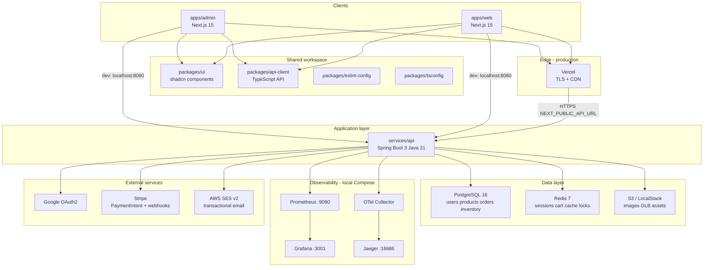
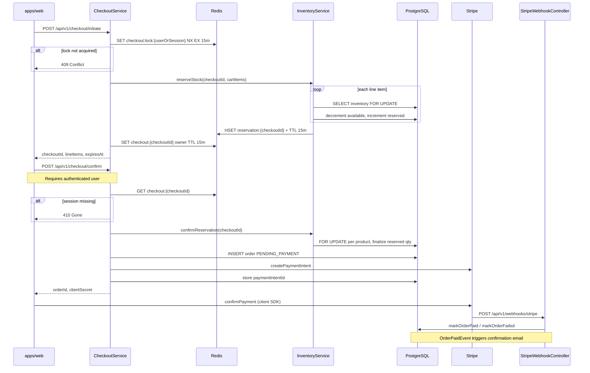
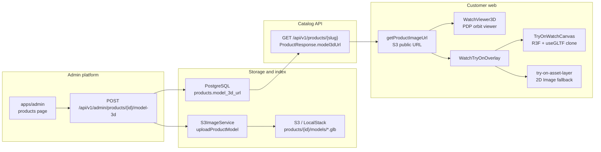

# System Architecture

Deep-dive architecture for Watch Store.

For deployment topology (Vercel + managed services), see [deployment.md](./deployment.md). For REST contracts, see [api.md](./api.md).

---

## System Diagram

Local development runs all tiers on Docker Compose with direct `localhost` ports. Production splits Next.js apps (Vercel) from the containerized API and managed Postgres, Redis, and S3.

### Interaction Summary

| Concern | Technology | Notes |
|---------|------------|--------|
| Customer & admin UI | Next.js 15 | Shared [`packages/ui`](../packages/ui); API via [`packages/api-client`](../packages/api-client) |
| API | Spring Boot 3, Java 21 | Virtual threads-friendly stack; OpenAPI at `/swagger-ui.html` |
| Relational data | PostgreSQL 16 | ACID orders/inventory; watch specs as columns + JSONB (`images`, `shipping_address`) |
| Cache & ephemeral state | Redis 7 | Refresh tokens, cart hashes, catalog page cache, checkout locks, reservation metadata |
| Object storage | S3 | Product images, gallery, `.glb` / `.gltf` models |
| Auth | JWT access + httpOnly refresh cookie | Guest cart header `X-Cart-Session-Id` |
| Payments | Stripe Test/Live | `STRIPE_ENABLED`; webhook idempotency table `stripe_webhook_events` |
| Email | SES v2 | Order confirmation, welcome, admin enquiry alerts |

### Local Compose services

| Service | Port | Role |
|---------|------|------|
| `api` | 8080 | Spring Boot API |
| `web` | 3003 | Customer Next.js (Docker) |
| `admin` | 3002 | Admin Next.js |
| `postgres` | 5432 | Primary database |
| `redis` | 6379 | Cache and locks |
| `localstack` | 4566 | S3 API (dev) |
| `prometheus` | 9090 | Metrics scrape |
| `grafana` | 3001 | Dashboards |
| `jaeger` | 16686 | Trace UI |
| `otel-collector` | 4317/4318 | OTLP ingest |

---

## Checkout and Payment Lifecycle

Checkout uses a **two-layer inventory model**: Redis coordinates checkout sessions and reservation metadata; PostgreSQL applies **pessimistic row locks** (`findByProductIdForUpdate`) when moving stock between `quantity_available` and `quantity_reserved`.

### Failure and HTTP semantics

| Stage | Condition | HTTP | Behavior |
|-------|-----------|------|----------|
| Initiate | Empty cart | 400 | `Cart is empty` |
| Initiate | Concurrent checkout | 409 | `checkout:lock` already held |
| Initiate | Insufficient stock | 409/422 | Reservation rolled back; lock deleted |
| Confirm | Expired checkout session | 410 | `Checkout session expired` |
| Confirm | Guest (no user) | 401 | Login required |
| Confirm | Owner mismatch | 403 | Session does not belong to caller |
| Confirm | Reservation cleared | 410 | `Reservation expired` |
| Confirm | Payment/order error | 5xx | `releaseReservation` on failure path |
| Webhook | Payment succeeded | 200 | Order → `PAID`, domain event + email |
| Webhook | Payment failed | 200 | Order → `FAILED` |

Implementation references: [`CheckoutService.java`](../services/api/src/main/java/com/watchstore/service/CheckoutService.java), [`InventoryService.java`](../services/api/src/main/java/com/watchstore/service/InventoryService.java), [`PaymentWebhookHandler.java`](../services/api/src/main/java/com/watchstore/infrastructure/stripe/PaymentWebhookHandler.java).

---

## 3D Asset Pipeline

3D models are optional per product. The customer experience prefers **GLB in WebGL** with a **2D dial fallback** when the model is missing or fails to load.

### VTO Render Policy

- **Primary:** `TryOnWatchCanvas` (transparent React Three Fiber canvas, environmental lighting, mesh transforms via [`toOverlayGroupTransform`](../apps/web/src/lib/try-on-transform-math.ts)).
- **Fallback:** Next.js `Image` when `model3dUrl` is absent or `onLoadError` sets `model3dFailed`.
- **Lifecycle:** `useGLTF.preload` when overlay opens; `key={model3dUrl}` remount; cloned scene disposed on unmount ([`try-on-model-loader.ts`](../apps/web/src/lib/try-on-model-loader.ts)).
- **PDP coexistence:** PDP [`WatchViewer3D`](../apps/web/src/components/watch-viewer-3d.tsx) unmounts while VTO is open to avoid dual WebGL contexts ([`product-media-gallery.tsx`](../apps/web/src/components/product-media-gallery.tsx)).

Schema migration: [`V8__product_3d_assets.sql`](../services/api/src/main/resources/db/migration/V8__product_3d_assets.sql) adds `model_3d_url` (S3 object key).

---

## Database Schema

Core tables from Flyway migrations (`V1` foundation + incremental features):

| Table | Purpose |
|-------|---------|
| `users` | Accounts, `role` (`CUSTOMER` / `ADMIN`), optional OAuth fields |
| `refresh_tokens` | Hashed refresh token rows (revocable sessions) |
| `brands`, `categories` | Catalog taxonomy |
| `products` | Watch listing, filter columns, `images` JSONB gallery, full-text `search_vector` |
| `products.model_3d_url` | S3 key for GLB/GLTF (`V8`) |
| `inventory` | `quantity_available`, `quantity_reserved`, optimistic `version` |
| `orders`, `order_items` | Order lifecycle, `payment_intent_id`, `shipping_address` JSONB |
| `user_wishlists` | Many-to-many wishlist |
| `enquiries` | Contact form + admin ops extensions (`V10`, `V11`) |
| `product_reviews` | Verified purchase reviews (`V9`) |
| `stripe_webhook_events` | Webhook idempotency (`V7`) |

Watch-specific attributes are stored on `products` (movement type, case material/dimension, water resistance, etc), keeping filter queries index-friendly.

Entity mapping: [`services/api/src/main/java/com/watchstore/domain/entity/`](../services/api/src/main/java/com/watchstore/domain/entity/).

---

## Caching and Redis key patterns

| Use case | Key pattern | TTL | Service |
|----------|-------------|-----|---------|
| Catalog list pages | `catalog:page:{filterHash}` | **60 seconds** | [`CatalogCacheService`](../services/api/src/main/java/com/watchstore/service/CatalogCacheService.java) |
| Guest/user cart | Cart-specific hashes via `CartService` | Session-oriented | [`CartService`](../services/api/src/main/java/com/watchstore/service/CartService.java) |
| Checkout mutex | `checkout:lock:{userId\|sessionId}` | **15 minutes** | [`CheckoutService`](../services/api/src/main/java/com/watchstore/service/CheckoutService.java) |
| Checkout owner | `checkout:{checkoutId}` | **15 minutes** | Same |
| Stock reservation | `reservation:{checkoutId}` (hash of productId → qty) | **15 minutes** | [`InventoryService`](../services/api/src/main/java/com/watchstore/service/InventoryService.java) |
| Refresh tokens | Redis-backed store | Per JWT refresh expiry | [`RefreshTokenStore`](../services/api/src/main/java/com/watchstore/infrastructure/redis/RefreshTokenStore.java) |

Cache invalidation: product mutations from admin APIs should evict catalog keys (see `CatalogCacheService` eviction helpers used from product write paths).

---

## Network and Security

### API

- Base path: `/api/v1/*`
- Health: `GET /api/v1/ping`
- Actuator: `/actuator/health`, `/actuator/prometheus`
- Interactive docs: `http://localhost:8080/swagger-ui.html`

### CORS and Cookies

- `CORS_ORIGINS` lists allowed Next.js origins (local: `3000`, `3002`, `3003`; production: Vercel domains).
- **Access token:** `Authorization: Bearer <jwt>` on API calls from browsers.
- **Refresh token:** httpOnly cookie set by [`AuthCookieService`](../services/api/src/main/java/com/watchstore/security/AuthCookieService.java); production uses `REFRESH_COOKIE_SECURE=true` and `SameSite=None` for cross-site Vercel → API ([deployment.md](./deployment.md)).

### Guest Cart

- Header: `X-Cart-Session-Id` (client-generated UUID) on cart and checkout initiate routes.
- On login/register, [`CartService.mergeGuestCartIntoUser`](../services/api/src/main/java/com/watchstore/service/CartService.java) consolidates guest lines into the authenticated cart.

### Stripe Webhooks

- Endpoint: `POST /api/v1/webhooks/stripe` (unsigned in dev only when configured; verifies `Stripe-Signature` in production).
- Processed asynchronously in the request thread with idempotent persistence before side effects.

### Object Storage URLs

- API stores **S3 keys** in the database; frontends resolve public URLs via `NEXT_PUBLIC_S3_IMAGE_BASE_URL`.

---

## Related

- [api.md](./api.md) — REST endpoint catalog and auth payloads
- [local-development.md](./local-development.md) — Bootstrap and integration testing
- [deployment.md](./deployment.md) — Production environment
