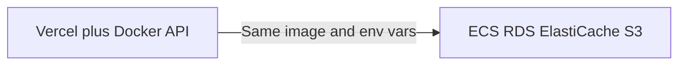

# Deployment Guide

Production uses a **split stack**: Next.js apps on **Vercel**, Spring Boot API on a **Docker host** (Render, Fly.io, or Railway), and managed **PostgreSQL**, **Redis**, and **AWS S3**. Local development stays on Docker Compose + LocalStack.

## Architecture

```
Browser → Vercel (web, admin) → HTTPS → API (Docker) → Postgres / Redis / S3
```

| Component | MVP host | Future AWS |
|-----------|----------|------------|
| Customer UI | Vercel `apps/web` | Vercel or CloudFront + ECS |
| Admin UI | Vercel `apps/admin` | Same |
| API | Docker image ([`services/api/Dockerfile`](../services/api/Dockerfile)) | ECS Fargate |
| Postgres | Neon / Supabase | RDS |
| Redis | Upstash / Redis Cloud | ElastiCache |
| Images | AWS S3 | Same bucket |

---

## Prerequisites

- GitHub repo connected to Vercel (two projects; see Phase 4)
- Domain (optional): `api.`, `www.`, `admin.` subdomains
- AWS account with S3 bucket
- Managed Postgres and Redis accounts

Copy [`.env.example`](../.env.example) for variable names.

---

## Phase 1 — API production settings (in repo)

Already implemented in code:

- **S3:** Leave `S3_ENDPOINT` empty for real AWS; LocalStack URL for local dev only ([`S3Config.java`](../services/api/src/main/java/com/watchstore/config/S3Config.java))
- **Auth cookies:** `REFRESH_COOKIE_SECURE=true`, `REFRESH_COOKIE_SAME_SITE=None` for cross-origin Vercel → API
- **Flyway:** Schema in `db/migration/`; demo seeds in `db/seed/` (dev/test only, not `prod` profile)
- **OAuth redirect:** Set `FRONTEND_WEB_URL` to the customer site URL (first `CORS_ORIGINS` entry is fallback)

---

## Phase 2 — Provision managed data

### PostgreSQL 16

1. Create a database (Neon, Supabase, or RDS-compatible).
2. Note `DB_HOST`, `DB_PORT`, `DB_NAME`, `DB_USER`, `DB_PASSWORD`.
3. Ensure the DB is empty before the first API start (Flyway runs schema migrations only in `prod`).

### Redis 7

1. Create a Redis instance (Upstash recommended for serverless-friendly TLS).
2. **Upstash:** set `REDIS_HOST`, `REDIS_PORT`, `REDIS_PASSWORD` from the console, and `REDIS_SSL_ENABLED=true`.
3. **Non-TLS:** set `REDIS_HOST` and `REDIS_PORT`; leave `REDIS_SSL_ENABLED` unset or `false`.

### AWS S3

1. Create bucket `watch-store-images` (or your name; set `S3_BUCKET`).
2. Set `AWS_REGION`.
3. Create an IAM user or role with `s3:PutObject`, `s3:GetObject`, `s3:DeleteObject` on the bucket.
4. Set `AWS_ACCESS_KEY_ID` and `AWS_SECRET_ACCESS_KEY` on the API host (or use IAM role on ECS later).
5. **Do not** set `S3_ENDPOINT` in production.
6. For Next.js image optimization on Vercel, set `S3_IMAGE_HOSTNAME` (e.g. `bucket.s3.us-east-1.amazonaws.com`) on the **web** project.

### Secrets

Generate a strong `JWT_SECRET` (256+ bits). Store all secrets in the host platform and Vercel env UIs — never commit them.

### Admin user (production)

Demo users are **not** seeded in `prod`. Create an admin after deploy:

- Register via API and promote in DB, or
- Run a one-off SQL insert with a BCrypt hash, or
- Add a dedicated non-seed migration in a controlled release process.

---

## Phase 3 — Deploy API (Docker)

Use the same image locally and in CI ([`.github/workflows/docker-build.yml`](../.github/workflows/docker-build.yml) pushes to GHCR on `main`).

### Required environment variables

```text
SPRING_PROFILES_ACTIVE=prod
DB_HOST, DB_PORT, DB_NAME, DB_USER, DB_PASSWORD
REDIS_URL (or REDIS_HOST + REDIS_PORT)
JWT_SECRET
CORS_ORIGINS=https://your-web.vercel.app,https://your-admin.vercel.app
FRONTEND_WEB_URL=https://your-web.vercel.app
REFRESH_COOKIE_SECURE=true
REFRESH_COOKIE_SAME_SITE=None
S3_BUCKET, AWS_REGION
AWS_ACCESS_KEY_ID, AWS_SECRET_ACCESS_KEY
GOOGLE_CLIENT_ID, GOOGLE_CLIENT_SECRET  (if using Google login)
```

### Render

Example blueprint: [`infra/deploy/render.yaml`](../infra/deploy/render.yaml). Create a **Web Service → Docker**, health check **`/api/v1/ping`** (not `/actuator/health` — that endpoint includes Redis and will fail if Redis env is wrong), attach env vars from Phase 2.

**Docker settings (required)** — use **one** of these; wrong context causes `"/src": not found` and build context ~2B:

| Field | Option A (repo root) | Option B (API folder) |
|-------|----------------------|------------------------|
| Root Directory | *(empty)* | `services/api` |
| Dockerfile Path | `services/api/Dockerfile` | `Dockerfile` |
| Docker Context / Context Directory | `services/api` | `.` |

Do **not** use repo root (`.`) as Docker context: the root [`.dockerignore`](../.dockerignore) excludes `services/`, so the API `COPY` steps fail on Render.

If build logs show `transferring context: 2B` or `checkstyle.xml not found`, fix the table above and redeploy.

### Fly.io

Example config: [`infra/deploy/fly.toml`](../infra/deploy/fly.toml).

```bash
fly secrets set DB_HOST=... JWT_SECRET=... CORS_ORIGINS=...
fly deploy --config infra/deploy/fly.toml
```

### DNS

Point `api.yourdomain.com` to the API host. Verify:

```bash
curl -s https://api.yourdomain.com/api/v1/ping
curl -s https://api.yourdomain.com/actuator/health
```

### Google OAuth

In Google Cloud Console, add authorized redirect URI:

`https://api.yourdomain.com/login/oauth2/code/google`

### Stripe (when enabled)

Webhook URL: `https://api.yourdomain.com/api/v1/webhooks/stripe`

---

## Phase 4 — Deploy frontends on Vercel

Create **two projects** from the same Git repository.

| Project | Root directory | Config |
|---------|----------------|--------|
| Customer store | `apps/web` | [`apps/web/vercel.json`](../apps/web/vercel.json) |
| Admin | `apps/admin` | [`apps/admin/vercel.json`](../apps/admin/vercel.json) |

**Vercel project settings:**

1. Root Directory: `apps/web` or `apps/admin`
2. Enable **Include source files outside of the Root Directory** (monorepo packages)
3. Environment variable (Production): `NEXT_PUBLIC_API_URL=https://api.yourdomain.com`
4. Optional (web only): `S3_IMAGE_HOSTNAME` for product images

Redeploy after changing `NEXT_PUBLIC_*` (baked at build time).

Update API `CORS_ORIGINS` to match final Vercel or custom domains (exact URLs, no wildcard).

### Smoke test

1. Open customer site → browse shop (SSR hits API).
2. Register / login → refresh token cookie on API domain.
3. Add to cart, checkout flow.
4. Admin login at admin URL.

### Cross-origin auth troubleshooting

| Symptom | Fix |
|---------|-----|
| Refresh always 401 | `CORS_ORIGINS` must include exact frontend origin; `allowCredentials` is already true |
| Cookie not sent | `REFRESH_COOKIE_SAME_SITE=None`, `REFRESH_COOKIE_SECURE=true`, API on HTTPS |
| OAuth lands wrong site | Set `FRONTEND_WEB_URL` to customer web URL |

---

## Phase 5 — CI/CD

### GitHub Actions

On push to `main` / `master`, [`docker-build.yml`](../.github/workflows/docker-build.yml) builds and pushes:

- `ghcr.io/<owner>/<repo>/watch-store-api`
- `ghcr.io/<owner>/<repo>/watch-store-web`
- `ghcr.io/<owner>/<repo>/watch-store-admin`

Pull with: `docker pull ghcr.io/<owner>/<repo>/watch-store-api:latest`

Wire your API host to pull from GHCR or build from the same Dockerfile.

### Vercel

Connect Git integration; production branch `main`. Preview deployments optional.

### Post-deploy checklist

- [ ] Strong `JWT_SECRET` and DB password
- [ ] `CORS_ORIGINS` matches Vercel/custom domains
- [ ] `REFRESH_COOKIE_SECURE=true`, `REFRESH_COOKIE_SAME_SITE=None`
- [ ] No Flyway seed migrations in prod
- [ ] S3 bucket and credentials working
- [ ] `NEXT_PUBLIC_API_URL` on both Vercel projects
- [ ] Google OAuth URIs updated
- [ ] Health + login + cart smoke test

---

## Phase 6 — Migrating to AWS

When moving off Render/Fly/Neon/Upstash:

### Mapping

| Current | AWS target |
|---------|------------|
| Vercel web/admin | Keep on Vercel, or ECS + ALB + CloudFront using existing Next Dockerfiles |
| Docker API on PaaS | **Same image** → ECS Fargate service |
| Neon Postgres | RDS PostgreSQL (`pg_dump` / `pg_restore`) |
| Upstash Redis | ElastiCache Redis |
| S3 bucket | Unchanged |

### ECS task environment

Mirror Phase 3 env vars in the task definition. Use IAM task role for S3 instead of access keys when possible.

### Infrastructure as code

Add `infra/terraform/` (VPC, RDS, ElastiCache, ECS, ALB, S3, IAM) without removing Docker Compose for local dev.

### Observability

Reuse [`infra/docker/prometheus/prometheus.yml`](../infra/docker/prometheus/prometheus.yml) against ECS service discovery or Amazon Managed Prometheus.



---

## Local development (unchanged)

```bash
make up
```

Uses `SPRING_PROFILES_ACTIVE=dev`, LocalStack, and Flyway seeds. See [local-development.md](./local-development.md).

## Optional: Compose prod overlay

```bash
docker compose -f docker-compose.yml -f docker-compose.prod.yml up -d api
```

Use for API-only testing with prod profile; production should use managed DB/Redis/S3, not bundled Compose databases.
